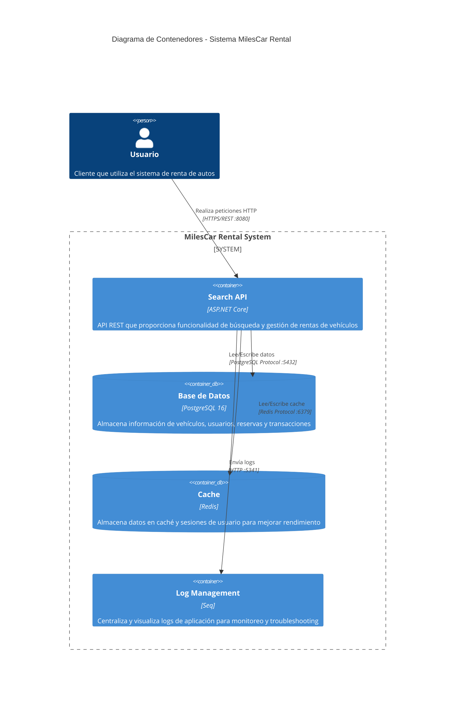

# Car Rental Search

## Tech Stack
- **Api Backend:** ASP.NET/.NET 8.0
- **Database:** PostgreSql
- **ORM:** Entity Framework Core
- **Logging:** Serilog
- **Caching:** Redis
- **Monitoring:** Seq
- **Containerization:** Docker

## Architecture (C4 - Containers)

This is a container-level C4 diagram that represents the services defined in the project. The diagram shows responsibilities and primary connections.

Mapping to docker-compose services:

- `api` -> `CarRentalSearch.Api` (container built from the repo, host port 8080 -> container 80)
- `postgres` -> PostgreSQL (database, container port 5432)
- `redis` -> Redis (cache, container port 6379, configured with a password)
- `seq` -> Seq (log aggregation, container port 5341 for ingestion, 8081 for web UI)

## Design Patterns and Principles
- **Repository Pattern:** Used for data access to abstract the data layer and provide a clean API for the application.
- **Dependency Injection:** Promotes loose coupling and enhances testability by injecting dependencies rather than hardcoding them.
- **DTO (Data Transfer Object):** Used to transfer data between layers, reducing the number of method calls and improving performance.
- **Single Responsibility Principle:** Each class has a single responsibility, making the code easier to maintain and test.
- **Domain-Driven Design (DDD):** Focuses on modeling the domain and its logic, ensuring that the software reflects the real-world processes and rules.

## Getting Started
1. Clone the repository.
2. Run `docker-compose up` to start the application.
3. Access the API at `http://localhost:8080/swagger/index.html`.
3. Access the monitor logs at `http://localhost:8081/#/login`.

